# WebM7 ヘッドレステスト マニュアル

WebM7 のエミュレータコアは、ブラウザなしで **Node.js から直接** 動かせます。画面描画・音声・UI といったブラウザ依存部を最小限のスタブで置き換えるだけで、CPU・メモリ・FDC・キーボード・表示ロジックをそのまま実行できます。

この仕組みを使うと、次のような自動テストが書けます。

- ディスクや BASIC プログラムを起動し、一定フレーム後の状態（CPU レジスタ・メモリ・VRAM）を検査する
- 任意のフレームの画面を画像（PPM）として書き出し、表示結果を目視・差分比較する
- キー入力を流し込んで操作を再現し、期待した動作になるか確かめる

本書は、その書き方とコア API をまとめたものです。本書だけで完結するように書いてありますので、上から順に読めばそのまま動かせます。

---

## 1. ヘッドレスとは

「ヘッドレス（headless）」とは、**画面（head）なしでプログラムを動かすこと**です。WebM7 は本来ブラウザで動くエミュレータですが、その心臓部であるエミュレータコア（`core/`）は「画面に絵を出す」「音を鳴らす」部分と切り離して作られています。そのため、ブラウザの代わりに Node.js でコアだけを動かす、ということができます。

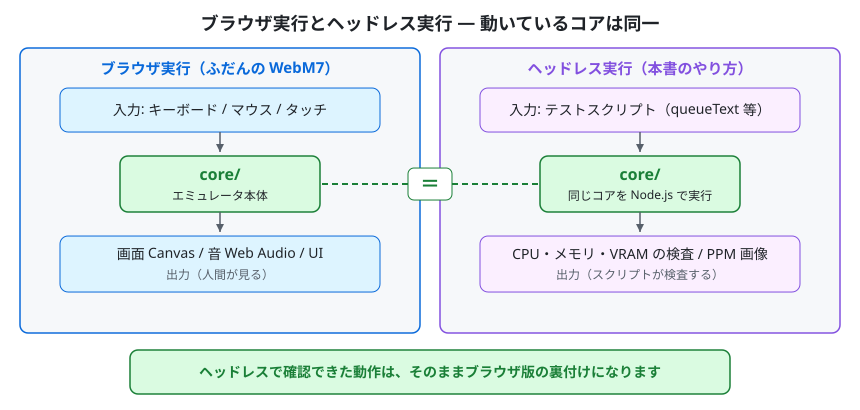

入力と出力をブラウザからテストスクリプトに置き換えるだけで、中で動くエミュレータ本体（`core/`）は同一です。

ポイントは、**動いているコアはブラウザ版とまったく同じ**だということです。ヘッドレスで確認できたことは、そのままブラウザ版の動作の裏付けになります（音やリアルタイムのタイミングなど、一部例外は第10章で説明します）。

テスト 1 本の全体の流れは次のとおりです。本書の章立てもこの順番に対応しています。

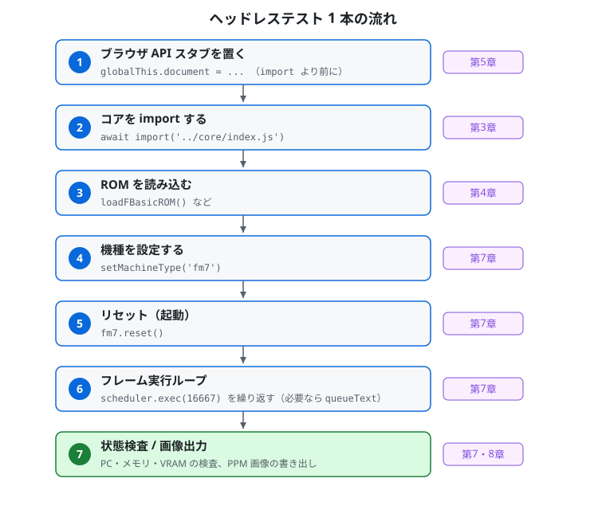

スタブ設置から状態検査まで 7 ステップ。各ステップの詳細は右側に示した章で説明します。

---

## 2. 前提環境

- **Node.js**（ES Modules 対応版。新しめの LTS を推奨）
- WebM7 のソース一式（`core/` ディレクトリ）
- ご自身で用意した **ROM イメージ**（第4章）
- 必要に応じてディスクイメージ（`.d77` など）やテープイメージ（`.t77` / `.wav`）

WebM7 のコアは ES Modules (`import`) で書かれています。テストスクリプトの拡張子は **`.mjs`** とすれば、Node.js がそれを ES Module として実行します（`package.json` などの追加設定は不要です）。

---

## 3. セットアップ（clone からテスト実行まで）

### 3.1 リポジトリを clone する

```bash
git clone https://github.com/7032/WebM7.git
cd WebM7
```

clone 直後のディレクトリ構成は次のとおりです。エミュレータコア `core/` がそのまま含まれており、これがヘッドレステストの実行対象になります。

```
WebM7/
├── core/                  ← 共有エンジン（テストはここを読み込む）
│   ├── index.js           公開 API の窓口（FM7 / 機種定数を再エクスポート）
│   ├── fm7.js             システム統合クラス（メモリマップ・I/O・スケジューラ連携）
│   ├── cpu6809.js         MC6809 CPU
│   ├── scheduler.js       タイミング制御（デュアル CPU 同期）
│   ├── fdc.js             フロッピーディスクコントローラ（D77/2D/HFE）
│   ├── keyboard.js        キーボード入力
│   ├── display.js         画面描画（VRAM・パレット・ライン描画）
│   ├── cmt.js             カセットテープ（T77/WAV）
│   └── …                  hfe.js / opn.js / psg.js / softkbd.js ほか
├── css/                   スタイルシート
├── icons/                 PWA アイコン
├── docs/                  ドキュメント（本書を含む）
├── index.html             ブラウザ版のメイン画面・UI
├── manifest.webmanifest   PWA マニフェスト
├── sw.js                  サービスワーカー
├── CHANGELOG.md  LICENSE.md
```

> ヘッドレステストに必要なのは `core/` だけです。テスト用のディレクトリやスクリプトは含まれていませんので、下記のとおり**ご自身で作成**します。

### 3.2 テスト用ディレクトリを作る

`core/` を相対パス `../core/` から読み込めるよう、リポジトリ直下に作業用ディレクトリ（例: `test/`）を作り、その中に `.mjs` を置きます。

```bash
mkdir test
# test/your_test.mjs を作成（中身は第6章の最小サンプルを参照）
```

```
WebM7/
├── core/
│   └── index.js …
└── test/                  ← 自分で作る
    └── your_test.mjs      ← ここにテストを書く（../core/ を読み込む）
```

スクリプト内では次のようにコアを読み込みます（公開窓口の `index.js` 経由が便利です）。

```javascript
const { FM7 } = await import('../core/index.js');
```

### 3.3 実行する

リポジトリルート（`WebM7/`）から実行します。

```bash
node test/your_test.mjs
# もしくは
cd test && node your_test.mjs
```

> ROM やディスクイメージは clone した中には含まれません。パスはスクリプト内で各自の環境に合わせて指定します（第4章参照）。

---

## 4. ROM の用意

エミュレータの起動には ROM イメージが必要です。**ROM はご自身で適法に用意し、任意のフォルダに置いてください**（WebM7 は ROM を同梱しません）。テストスクリプトでは、そのフォルダを定数にして読み込みます。

必要な ROM は機種により異なります。読み込みメソッドと、本書のサンプルコードで使う**ファイル名の例**は次のとおりです（ファイル名自体は自由ですが、下表はブラウザ版 WebM7 本体が要求するファイル名と同じにしてあります。同じ名前にしておくと、ブラウザ版と ROM フォルダをそのまま共用できるのでおすすめです）。

| 区分 | 読み込みメソッド | サンプルでの名前例 | サイズの目安 | 主な対象機種 |
|---|---|---|---|---|
| F-BASIC ROM | `loadFBasicROM()` | `fbasic30.rom` | 約 31KB | 全機種（常に必須。本体搭載 ROM） |
| DOS ブート ROM | `loadBootROM()` | `boot_dos.rom` | 512 バイト | FM-7 系（Boot Mode: DOS で必須） |
| BASIC ブート ROM | `loadBootBasROM()` | `boot_bas.rom` | 512 バイト | FM-7 系（Boot Mode: BASIC で必須） |
| サブシステム ROM (Type-C) | `loadSubROM()` | `subsys_c.rom` | 約 10KB | 全機種（常に必須。サブ CPU 用） |
| イニシエータ ROM | `loadInitiateROM()` | `initiate.rom` | 8KB | FM77AV 系（起動に必須） |
| サブシステム ROM (Type-A) | `loadSubROM_A()` | `subsys_a.rom` | 8KB | FM77AV 系 |
| サブシステム ROM (Type-B) | `loadSubROM_B()` | `subsys_b.rom` | 8KB | FM77AV 系 |
| CG ROM | `loadCGROM()` | `subsyscg.rom` | 最大 8KB | FM77AV 系（必須） |
| 漢字 ROM（第1水準） | `loadKanjiROM()` | `kanji.rom` | 128KB | FM-7 では任意（漢字表示用）、FM77AV 以降は必須 |
| 漢字 ROM（第2水準） | `loadKanji2ROM()` | `kanji2.rom` | 128KB | FM77AV40 系（FM77AV40EX では必須） |
| 辞書 ROM | `loadDicromROM()` | `dicrom.rom` | 256KB | FM77AV40 系（FM77AV40EX では必須） |
| 拡張サブ ROM | `loadExtSubROM()` | `extsub.rom` | 48KB | FM77AV40EX（必須） |

機種ごとに読み込むべき ROM の目安は次のとおりです（ブラウザ版 WebM7 本体の必須／任意の区分と同じです）。

- **FM-7** … F-BASIC ROM＋サブシステム Type-C＋Boot Mode に対応するブート ROM（BASIC なら BASIC ブート ROM、DOS なら DOS ブート ROM）が必須です。
- **FM77AV / FM77AV20 / FM77AV20EX / FM77AV40 / FM77AV40EX/SX** … F-BASIC ROM・サブシステム Type-C に加えてイニシエータ ROM・サブシステム Type-A / Type-B・CG ROM・漢字 ROM（第1水準）が必須です（ブート ROM（DOS / BASIC）は不要です）。
- **FM77AV40EX/SX** … さらに漢字 ROM（第2水準）・辞書 ROM・拡張サブ ROM が必須です。

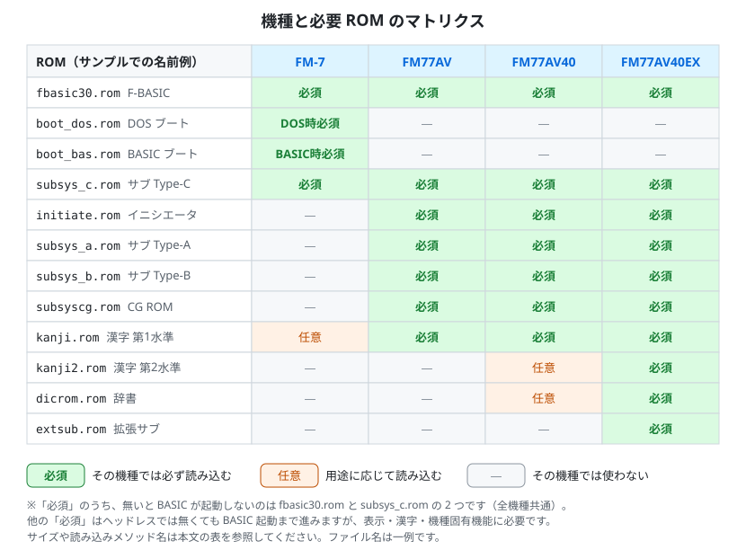

機種ごとの必須 ROM・任意 ROM を色分けしたマトリクスです。緑がその機種で必ず読み込むもの（ブート ROM は選択した Boot Mode に対応する方）、橙は用途に応じて読み込むものです。

> **ヘッドレスでの実態** … 「必須」のうち、無いと BASIC の起動自体に失敗するのは F-BASIC ROM（`fbasic30.rom`）とサブシステム Type-C（`subsys_c.rom`）の 2 つです（全機種共通。起動実験で確認済み）。それ以外の「必須」ROM は、ヘッドレスでは無くても BASIC 起動まで進みますが、表示・漢字・機種固有機能に必要なため、ブラウザ版本体と同じくフルセットで読み込むことを推奨します。

> ROM 読み込みメソッドはいずれも `ArrayBuffer`（または `Uint8Array.buffer`）を引数に取ります。`readFileSync()` で読んだバッファをそのまま渡せます。

---

## 5. ブラウザ API スタブ（必須の前処理）

コアは一部でブラウザのグローバル（`document` / `window` / `AudioContext` 等）を参照します。ヘッドレスではこれらが存在しないため、**コアを `import` する前に**最小限のスタブをグローバルへ仕込みます。

「スタブ」とは、本物の代わりに置く「何もしない最小限のニセモノ」のことです。コアが触っても落ちなければよいので、中身は空でかまいません。

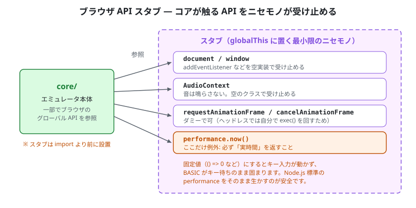

コアが参照するブラウザ API をスタブが受け止めます。`performance.now()` だけは例外で、必ず実時間を返す必要があります。

```javascript
globalThis.document = { addEventListener: () => {}, removeEventListener: () => {} };
globalThis.window   = { addEventListener: () => {}, removeEventListener: () => {} };
globalThis.AudioContext = class {
    createGain()         { return { connect: () => {}, gain: { value: 0 } }; }
    createBuffer()       { return {}; }
    createBufferSource() { return { connect: () => {}, start: () => {}, stop: () => {} }; }
    get destination()    { return {}; }
    get sampleRate()     { return 48000; }
};
globalThis.requestAnimationFrame = () => 0;
globalThis.cancelAnimationFrame  = () => {};

// 時刻 API。Node.js には performance が標準で存在するため、通常この行は何もしません。
// もし存在しない環境で補う場合も、必ず「実時間」を返すこと（固定値は不可。下の注意参照）
globalThis.performance ||= { now: () => Date.now() };
```

> **重要: `performance.now()` を固定値にしないでください。** `now: () => 0` のような固定値スタブにすると、経過時間が常にゼロと見なされてキー入力の処理が動かなくなり、BASIC がキー待ちのまま固まります。必ず実時間（Node.js 標準の `performance`、または `Date.now()`）を返してください。上記の `||=` は「存在しないときだけ補う」書き方なので、Node.js 標準の `performance` をそのまま生かせます。

> `requestAnimationFrame` / `cancelAnimationFrame` はブラウザ版の描画ループが参照します。ヘッドレスでは自分で `scheduler.exec()` を回すため実際にはほぼ使われませんが、安全のためダミーを入れておきます。

スタブを置いたあとで、動的 `import` でコアを読み込みます。

```javascript
const { FM7 } = await import('../core/index.js');
```

> `import` 文をファイル先頭に書くと、スタブの設定より先にコアが読み込まれてしまいます。**必ず動的 `import`（`await import(...)`）を使い、スタブの後に置いてください。**

---

## 6. 最小サンプル

FM-7 として起動し、フレームを回して BASIC のプロンプトまで進め、CPU の状態を表示する最小例です。このまま写して動かせます（ROM のパスとファイル名だけ各自の環境に合わせてください）。

```javascript
#!/usr/bin/env node
import { readFileSync } from 'fs';

// --- 1) ブラウザ API スタブ（第5章参照、import より前に） ---
globalThis.document = { addEventListener: () => {}, removeEventListener: () => {} };
globalThis.window   = { addEventListener: () => {}, removeEventListener: () => {} };
globalThis.AudioContext = class {
    createGain()         { return { connect: () => {}, gain: { value: 0 } }; }
    createBuffer()       { return {}; }
    createBufferSource() { return { connect: () => {}, start: () => {}, stop: () => {} }; }
    get destination()    { return {}; }
    get sampleRate()     { return 48000; }
};
globalThis.requestAnimationFrame = () => 0;
globalThis.cancelAnimationFrame  = () => {};
globalThis.performance ||= { now: () => Date.now() };   // 実時間を返す（固定値は不可）

// --- 2) コア読み込み（公開窓口の index.js 経由） ---
const { FM7 } = await import('../core/index.js');

// --- 3) ROM フォルダ（各自のパスに置き換える） ---
const ROM_DIR = process.env.WEBM7_ROM_DIR || './roms';
const rom = (name) => new Uint8Array(readFileSync(`${ROM_DIR}/${name}`));

// --- 4) インスタンス生成・ROM 読み込み・機種設定 ---
const fm7 = new FM7();
fm7.loadFBasicROM(rom('fbasic30.rom'));   // ファイル名は各自の用意したものに合わせる
fm7.loadBootROM(rom('boot_dos.rom'));
fm7.loadBootBasROM(rom('boot_bas.rom'));
fm7.loadSubROM(rom('subsys_c.rom'));
fm7.setMachineType('fm7');                // 'fm7' | 'fm77av' | 'fm77av40' | 'fm77av40ex'

// --- 5) ディスク挿入（任意。ディスクなしなら ROM BASIC が起動します） ---
// const disk = readFileSync('./disk.d77');
// fm7.fdc.loadDisk(0, new Uint8Array(disk).buffer);   // ドライブ 0 に挿入

// --- 6) リセットして起動 ---
fm7.reset();

// --- 7) 1 フレーム = 16667 マイクロ秒（60Hz）。600 フレーム実行して起動を待つ ---
const FRAME_US = 16667;
const runFrames = (n) => { for (let i = 0; i < n; i++) fm7.scheduler.exec(FRAME_US); };
runFrames(600);

// --- 8) キー入力を流し込む（BASIC のプロンプト到達後） ---
fm7.keyboard.queueText('PRINT 123\n');
while (fm7.keyboard.autoTypePending) runFrames(1);
runFrames(60);   // 最後のキーが処理されるまで少し余分に回す

// --- 9) 状態を表示 ---
console.log(`Main PC = $${fm7.mainCPU.pc.toString(16)}`);
console.log(`Sub  PC = $${fm7.subCPU.pc.toString(16)}`);
```

> `ROM_DIR` とファイル名は、ご自身が用意した ROM の置き場所・名前に合わせて書き換えてください。本書はサンプルとして汎用的なパス・名前を示しています。

---

## 7. コア API リファレンス

### 7.1 生成・リセット

```javascript
const fm7 = new FM7();
fm7.setMachineType('fm77av');   // 機種を設定（ROM 読み込み後・reset 前に）
fm7.reset();                    // 全システムリセット。ブート経路を機種・メディアから自動判定
```

機種定数（`core/index.js` から re-export）:

| 文字列 | 機種 |
|---|---|
| `'fm7'` | FM-7 |
| `'fm77av'` | FM77AV |
| `'fm77av40'` | FM77AV40 |
| `'fm77av40ex'` | FM77AV40EX |

#### 7.1.1 起動経路の指定（ブートモード）

`reset()` が選ぶ起動経路は、機種と **ブートモード**（`'basic'` / `'dos'`）で決まります。ブラウザ版の「Boot Mode」に相当する設定はヘッドレスでは次のフィールドで行います（`reset()` の**前**に設定）。

```javascript
fm7._bootModeOverride = 'basic';   // 'basic' または 'dos'
fm7._bootModeExplicit = true;      // 明示選択（FM77AV 系でもこの値を優先させる）
fm7.reset();
```

| 機種 | ブートモード | 起動経路 |
|---|---|---|
| FM-7 | `'basic'` | BASIC ブート ROM（`loadBootBasROM()`）を `$FE00` から **実コードとして実行**します。ブートセクタの読み込みや F-BASIC への遷移も ROM 側のコードが行います。 |
| FM-7 | `'dos'` | DOS ブート ROM（`loadBootROM()`）を `$FE00` から実コードとして実行します。ただしドライブ 0 のブートセクタが特定の配置（NEW BOOT 形式・`$0100` 起点の IPL）と判定された場合は、互換性確保のためエミュレータ側で該当セクタを先読みして IPL の実行を省略します。 |
| FM77AV 系 | どちらでも | イニシエータ ROM（`loadInitiateROM()`）を `$6000` から **実コードとして実行**します。ブートモードは `$FD0B` の起動状態レジスタとイニシエータ引き渡し後の扱いにのみ影響します。`_bootModeExplicit` を `true` にしない場合は、ドライブ 0 にディスクがあれば `'dos'`、無ければ `'basic'` として扱われます。 |

**忠実な起動条件（ブート ROM を実コードとして実行する経路）** を固定したい場合の指定は次のとおりです。

- FM-7 … `_bootModeOverride = 'basic'`、`_bootModeExplicit = true` とし、BASIC ブート ROM を読み込んでおく（この経路ではエミュレータ側による先読み・省略は行われません）。
- FM77AV 系 … イニシエータ ROM を読み込んでおく（イニシエータ ROM が無い場合のみ、フォールバックとして JS 側の直接起動が使われます）。

> **注意（実行時 ROM 調整について）** … README「ROMファイルの取り扱いについて」に記したとおり、FM77AV 系ではイニシエータ ROM のメモリ上コピーに対し、機種判定箇所の抽象化（機種名に相当するバイト列の調整）を `reset()` のたびに行います。この調整はブラウザ版・ヘッドレス版とも同じで、元の ROM ファイルには手を加えません。

**実行時 ROM 調整・起動補助の無効化（`romAdjust`）** … `fm7.romAdjust`（真偽値、既定値 `true`）を `false` にすると、上記の互換性確保のための調整をすべて行わず、ROM をそのまま実コードとして実行します。`reset()`／起動の**前**に設定してください（`reset()` の中で参照されます）。

```javascript
fm7.romAdjust = false;             // 実行時 ROM 調整・起動補助を行わない（reset() の前に設定）
fm7._bootModeOverride = 'basic';   // 起動経路も明示する
fm7._bootModeExplicit = true;
fm7.reset();
```

`romAdjust = false` で無効になるもの:

- FM77AV 系: イニシエータ ROM のメモリ上コピーに対する機種判定箇所の抽象化（バイト列の調整）。イニシエータ ROM は読み込んだままの内容で実行されます。
- FM-7 の `'dos'` モード: NEW BOOT 形式・`$0100` 起点 IPL と判定されたディスクに対するセクタ先読みと IPL 実行の省略。DOS ブート ROM と IPL が常に実コードとして実行されます。

次のものは実機と同じ動作（ハードウェア挙動）であり `romAdjust` の影響を受けません: ブート ROM 末尾のベクタ領域の RAM への反映、電源投入時の FDC 初期化、FM77AV 系でイニシエータ ROM が無い場合のフォールバック起動、DOS ブート ROM コードの `$FE00` への配置。

したがって「忠実な起動」を固定する指定は **`romAdjust = false` + ブートモードの明示（`_bootModeOverride` と `_bootModeExplicit = true`）** の組み合わせです。既定値（`true`）の動作は従来と同一です。

### 7.2 実行（時間を進める）

スケジューラにマイクロ秒を渡して、その分だけエミュレーションを進めます。

```javascript
fm7.scheduler.exec(16667);   // 約 1 フレーム（60Hz = 16,667 マイクロ秒）進める
fm7.scheduler.step();        // メイン CPU を 1 命令だけ実行（戻り値 = 消費サイクル数）
```

FM-7 系はメイン CPU とサブ CPU の 2 つの MC6809 を持つデュアル CPU 構成です。スケジューラが両者の同期を保ちながら進めるため、テスト側は `exec()` を呼ぶだけでかまいません。

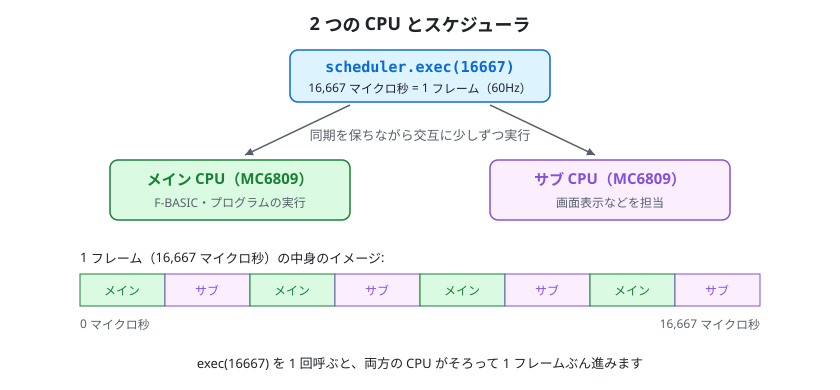

`exec(16667)` を 1 回呼ぶと、メイン CPU とサブ CPU の両方がそろって 1 フレーム（16,667 マイクロ秒 = 60Hz）ぶん進みます。

複数フレームを回すヘルパー例:

```javascript
const runFrames = (n) => { for (let i = 0; i < n; i++) fm7.scheduler.exec(16667); };
runFrames(300);
```

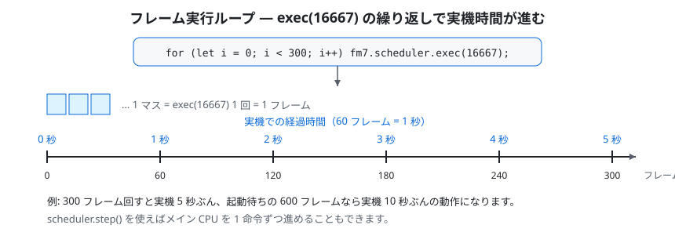

`exec(16667)` を繰り返すほど実機時間が進みます。60 フレームで実機 1 秒、300 フレームで実機 5 秒ぶんです。

### 7.3 ディスク

```javascript
fm7.fdc.loadDisk(driveNum, arrayBuffer);   // driveNum: 0〜3、D77/2D/HFE を自動判別
fm7.fdc.selectDisk(driveNum, diskIdx);     // 連結された複数ディスクから選択
```

`loadDisk` には `ArrayBuffer` を渡します（`new Uint8Array(buf).buffer`）。

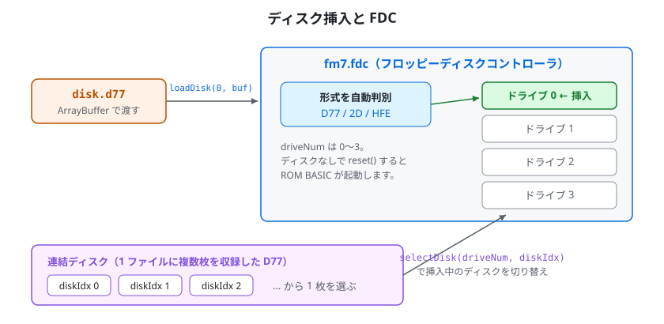

`loadDisk` で渡したイメージは形式（D77 / 2D / HFE）が自動判別されて指定ドライブに入ります。複数枚を連結した D77 では `selectDisk` で挿入中の 1 枚を切り替えます。

### 7.4 キー入力

**(a) テキスト自動入力 `queueText`（推奨）**

```javascript
fm7.keyboard.queueText('LOAD"PROG"\n', { charGap: 2, lineGap: 12 });
```

- `\n` は RETURN として扱われます
- `charGap` … 通常キー間の間隔（フレーム数。既定 2）
- `lineGap` … RETURN 後の間隔（フレーム数。既定 12。BASIC が前の行を処理する時間を確保します）

`queueText` はキューに文字を積みます。送出はスケジューラが自動で行います。コア内部で、エミュレーション時間が 1 フレームぶん（16,667 マイクロ秒）進むごとにオートタイプが 1 回進むよう配線されているため、**テスト側は `scheduler.exec()` でフレームを回し続けるだけ**でキーが順に送られます。


キューに積んだキーは、スケジューラが毎フレーム自動で進めるオートタイプにより `charGap`（既定 2 フレーム）間隔で送出され、RETURN の後だけ `lineGap`（既定 12 フレーム）待ちます。手動の tick は不要です。

送出が終わったかどうかは `autoTypePending` で確認できます。

```javascript
fm7.keyboard.queueText('FILES\n');
while (fm7.keyboard.autoTypePending) fm7.scheduler.exec(16667);
runFrames(60);   // 最後のキーが BASIC に処理されるまで少し余分に回す
```

- `autoTypePending` … 送出待ちのキーが残っていれば真
- `clearAutoType()` … 送出待ちのキューを破棄する
- `autoTypeTick(elapsedUs)` … オートタイプを手動で進める低レベルメソッド。スケジューラが自動で呼ぶため通常は不要です（追加で呼ぶと送出ペースがその分速まります）

なお、オートタイプは「前のキーが消費されてから次を送る」自動ペース制御つきです。それでも、起動直後など**入力受付前に送ると取りこぼす**ことがあるため、BASIC の `OK`（Ready）プロンプト到達を待ってから送ってください（先にフレームを十分回しておきます）。

**(b) 単発キーコード送出 `_pushKey`（低レベル API・上級者向け）**

```javascript
fm7.keyboard._pushKey(0x0D);   // RETURN（カーソルキーやファンクションキー等の単発送出に）
```

`_pushKey` はハードウェアのキーバッファへ **FM-7 のキーコード** を 1 つ直接積みます。コードの解釈は現在のキーボードモード（FM-7 の ASCII モード / FM77AV 系のスキャンコードモード）に依存し、スキャンコードモードではビット 7 を立てるとブレイク（離す）コードになります。送出ペースの調整や BASIC 側の受付待ちは一切行われないため、**文字列やコマンドの入力には向きません**。通常のテキスト入力には `queueText` を使ってください。

### 7.5 ジョイスティック入力

ジョイスティックは通常ブラウザの Gamepad API から読み取られ、そのポーリングは描画ループの中でだけ動きます。ヘッドレスでは描画ループが回らないためポーリングも走りません。そこで、プログラムから方向・トリガを直接与えるための公開 API を使います。

**(a) 状態の設定 `setJoystickState`（推奨）**

```javascript
// 名前付きで指定（押しているものだけ true。省略したものは離した扱い）
fm7.setJoystickState(0, { right: true, trigger1: true });   // ポート1: 右＋トリガ1

// 生バイト（active-low: 0xFF＝全解放）でも指定可
fm7.setJoystickState(0, 0xF7);   // bit3(右)だけ 0 ＝右
```

- 第1引数 … FM ポート（`0`＝ジョイスティック1、`1`＝ジョイスティック2）
- 第2引数 … 次のフィールドを持つオブジェクト、または active-low の生バイト

| フィールド | ビット | 生バイト（そのボタンだけ押下時） |
|---|---|---|
| `up` | bit0 | `0xFE` |
| `down` | bit1 | `0xFD` |
| `left` | bit2 | `0xFB` |
| `right` | bit3 | `0xF7` |
| `trigger1` | bit4 | `0xEF` |
| `trigger2` | bit5 | `0xDF` |

押している状態は次に変更するまで保持されます（描画ループが無いため上書きされません）。設定値は OPN のポート（`$FD15`／`$FD16`）経由でプログラムから読み戻されます。

**(b) 解放 `clearJoystickState`**

```javascript
fm7.clearJoystickState(0);   // ポート1を全解放（0xFF）へ
fm7.clearJoystickState();    // 引数省略で両ポートを解放
```

入力を与えたら、対象プログラムが読み取れるよう `scheduler.exec()` でフレームを進めてください。押しっぱなし・離しの表現は、設定→数フレーム実行→解放、の順で書けます。

```javascript
fm7.setJoystickState(0, { trigger1: true });   // 押す
runFrames(3);                                  // 数フレーム保持
fm7.clearJoystickState(0);                      // 離す
runFrames(3);
```

### 7.6 状態の参照（検査用）

| プロパティ | 内容 |
|---|---|
| `fm7.mainCPU.pc` | メイン CPU プログラムカウンタ |
| `fm7.subCPU.pc` | サブ CPU プログラムカウンタ |
| `fm7.mainRAM` | メイン RAM（`Uint8Array`） |
| `fm7.display.vram` | VRAM（`Uint8Array`） |
| `fm7.display.displayMode` | 表示モード |
| `fm7.display.crtOn` | CRT 出力の有効フラグ |
| `fm7.scheduler.mainCyclesTotal` | 実行済みメイン CPU サイクル総数 |

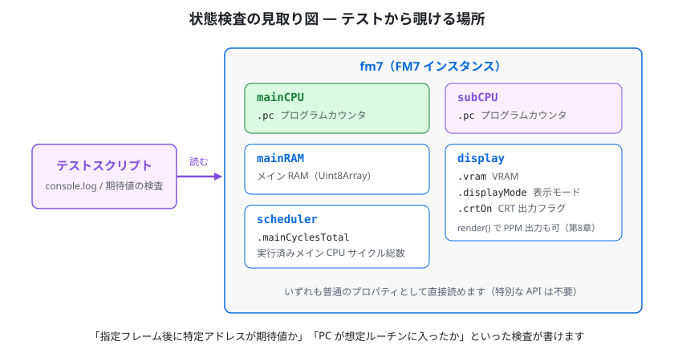

`fm7` インスタンスの中の CPU・メモリ・VRAM などを、テストスクリプトから普通のプロパティとして直接読めます。

メモリやレジスタ、VRAM を直接読めるので、「指定フレーム後に特定アドレスが期待値か」「PC が想定ルーチンに入ったか」といった検査が書けます。

---

## 8. 画面のキャプチャ（PPM 出力）

ヘッドレスでは本物の Canvas がないため、`getContext('2d')` 互換の最小シムを用意して `display.render()` に渡し、描画結果のピクセルを受け取ります。受け取った RGB を **PPM (P6)** として書き出すと、画像ビューア（ImageMagick・GIMP 等）で確認できます。

流れは次のとおりです。

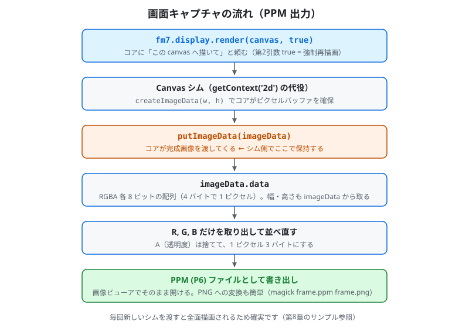

`render()` の描画結果を Canvas シムの `putImageData` で受け取り、RGBA から RGB を取り出して PPM (P6) として書き出します。

`render()` がシムに対して実際に呼ぶのは `getContext` / `createImageData` / `putImageData`（および一部の経路で `drawImage`）だけです。`canvas.width` / `canvas.height` は `render()` 自身が表示モードに合わせて設定します。完成画像は `putImageData` に渡されてくるので、シム側でそれを保持しておくのが確実です。

```javascript
import { writeFileSync } from 'fs';

// 最小 Canvas シム
class CtxShim {
    constructor() { this.imageData = null; }
    createImageData(w, h) { return { data: new Uint8ClampedArray(w * h * 4), width: w, height: h }; }
    putImageData(imageData) { this.imageData = imageData; }   // 完成画像を保持する
    drawImage() {}                                            // 一部の経路用（空実装で可）
}
class CanvasShim {
    constructor() { this.width = 0; this.height = 0; this._ctx = new CtxShim(); }
    getContext() { return this._ctx; }
}

function savePPM(fm7, path) {
    const canvas = new CanvasShim();           // 毎回新しいシムを渡す（全面描画させるため）
    fm7.display.render(canvas, true);          // 第2引数 true = 強制再描画
    const img = canvas.getContext().imageData; // putImageData で受け取った imageData
    const W = img.width, H = img.height;       // サイズは imageData から取るのが確実
    const header = `P6\n${W} ${H}\n255\n`;
    const buf = Buffer.alloc(header.length + W * H * 3);
    buf.write(header, 0);
    let off = header.length;
    const data = img.data;
    for (let i = 0; i < W * H; i++) {
        buf[off++] = data[i * 4];      // R
        buf[off++] = data[i * 4 + 1];  // G
        buf[off++] = data[i * 4 + 2];  // B
    }
    writeFileSync(path, buf);
}

// 使用例
runFrames(180);
savePPM(fm7, './out/frame_180.ppm');
```

> 出力先は任意です。`test/out/` のように作業ディレクトリ内へまとめると整理しやすいです。PPM はそのままでも開けますが、`magick frame.ppm frame.png` などで PNG に変換すると扱いやすくなります。

書き出される PPM (P6) ファイルの中身は、次のような単純な構造です。

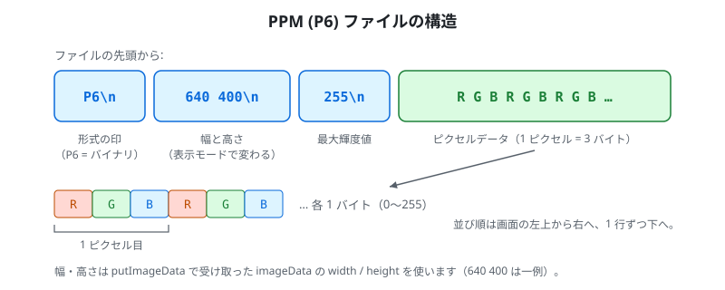

テキストのヘッダ 3 行（形式 `P6`・幅と高さ・最大輝度値 255）の後に、1 ピクセル 3 バイトの RGB データが左上から順に並びます。

---

## 9. テープ（参考）

```javascript
fm7.cmt.loadT77(new Uint8Array(readFileSync('./tape.t77')).buffer);   // T77 形式
fm7.cmt.loadWAV(new Uint8Array(readFileSync('./tape.wav')).buffer);   // WAV 形式
```

その後 BASIC 側で `RUN"CAS:"` / `LOAD"CAS:"` / `LOADM"CAS:",,R` 等を `queueText` で送り、フレームを進めて読み込ませます。

> **既知の制約** … ヘッドレスでは、テープからの **LOAD（読み込み）は完走しない**ことがあります。タイミング依存が強く、ブラウザ実機相当の挙動を再現しきれないためです。一方で **SAVE（書き込み・録音）側は動作**します。読み込み系の自動テストはディスク（D77）を使うのが確実です。テープ読み込みの最終確認はブラウザで行ってください。

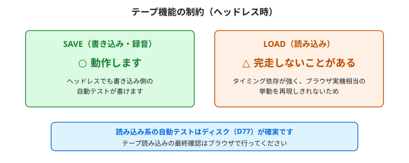

ヘッドレスでは SAVE 側は動作しますが、LOAD 側は完走しないことがあります。読み込み系のテストはディスクを使うのが確実です。

---

## 10. 既知の制約・注意点

- **`import` の前にスタブを置く** … `document` / `window` / `AudioContext` 等のスタブは、必ずコアを `import` する前にグローバルへ設定します（動的 `import` を使います）。
- **`performance.now()` は実時間を返すこと** … 固定値（`() => 0` など）にするとキー入力の処理が動かなくなり、BASIC がキー待ちのまま固まります。Node.js 標準の `performance` をそのまま使うか、補う場合は `Date.now()` など実時間を返してください。
- **`setMachineType` → `reset` の順** … 機種を設定し ROM を読み込んでから `reset()` します。`reset()` がブート経路を機種・メディアから判定します。
- **テープ LOAD は完走しない場合がある**（第9章）。読み込み系テストはディスク優先。
- **オートタイプは受付開始を待ってから** … `queueText` 後はフレームを回し続ければ自動送出されますが、ROM ローダ実行中など入力受付前に送ると取りこぼすことがあります。`OK`（Ready）プロンプト到達を待ってから送ってください。
- **画面サイズは表示モードで変わる** … 幅・高さは `render()` 後に確定します。PPM 書き出しは `putImageData` で受け取った `imageData` の `width` / `height` を使ってください（第8章のサンプルはそうなっています）。

---

## 11. テストのひな型として

新しいテストを書くときは、本書の構成をそのままひな型にできます。

1. **第5章のブラウザ API スタブ**をファイル先頭にコピーする（`import` より前）
2. **第6章の最小サンプル**のセットアップ部（生成 → ROM 読み込み → `setMachineType` → `reset`）を流用する
3. 検証したい内容に応じて、**第7章の状態参照**（メモリ・レジスタ・VRAM）や**第8章の PPM 出力**を組み合わせる

スタブ＋セットアップは毎回ほぼ同じです。自分用の共通ヘルパー（例: `test/harness.mjs`）に切り出して `import` すると、各テストが短く書けます。

---

## まとめ

1. ブラウザ API スタブを `import` 前に設定する（`performance.now()` は実時間）
2. `FM7` を生成し、ROM 読み込み → `setMachineType` → `reset`
3. `scheduler.exec(16667)` でフレームを進める
4. メモリ・レジスタ・VRAM を読んで検査、または Canvas シム経由で PPM 画像を書き出す
5. キー入力は `queueText` で積み、フレームを回して自動送出させる

これだけで、ブラウザを開かずに WebM7 の動作を自動検証できます。
