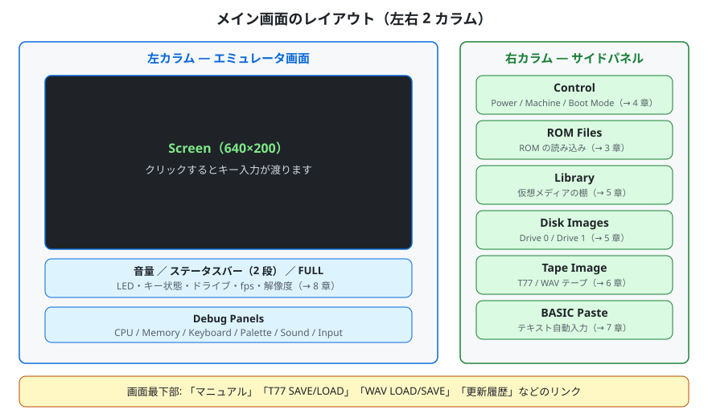
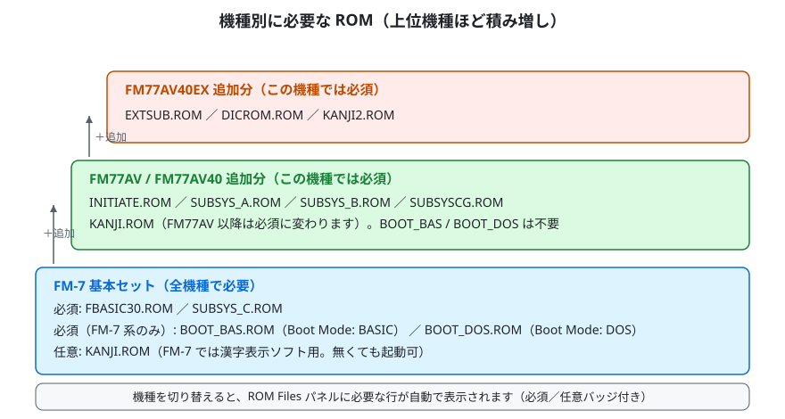
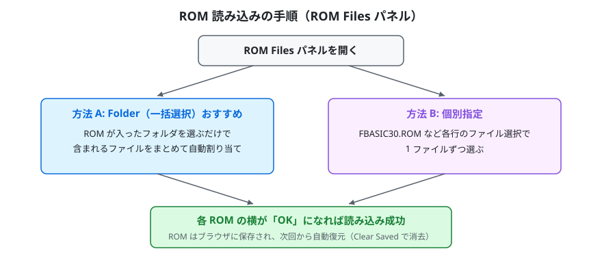
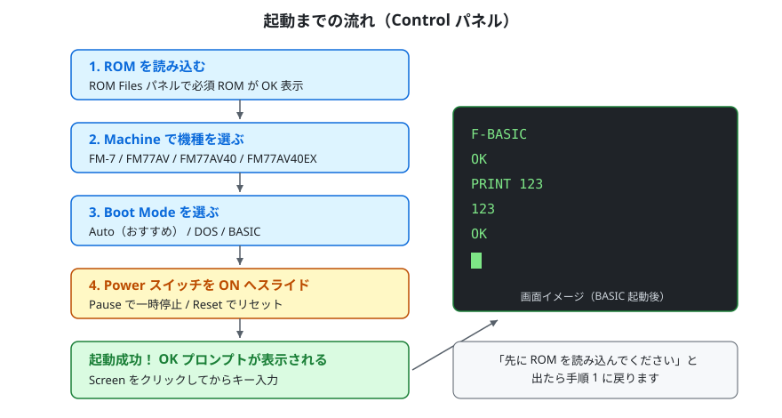
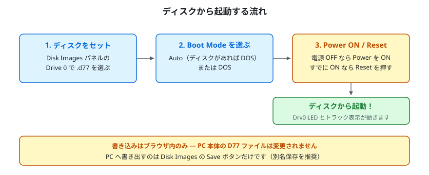
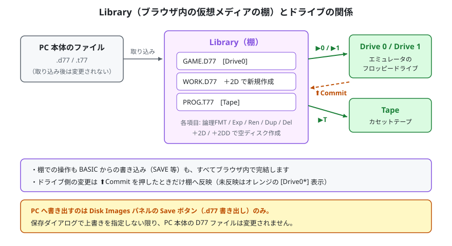
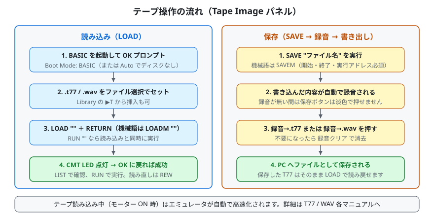
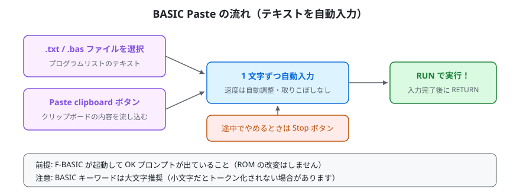
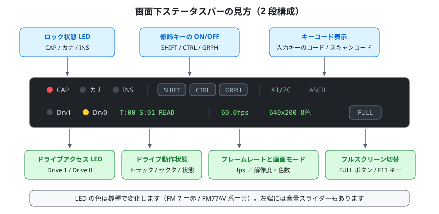
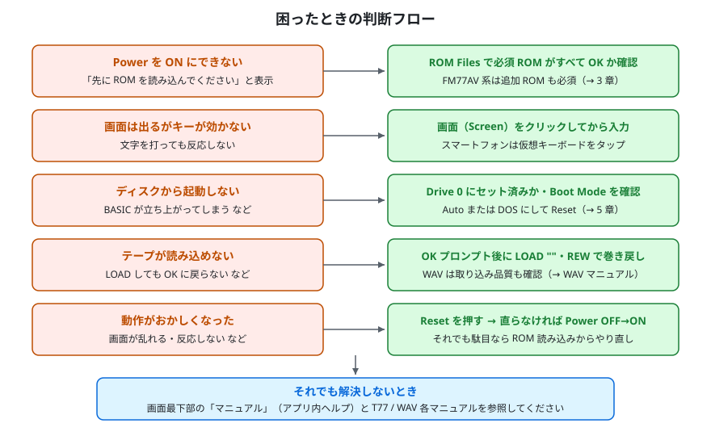

# WebM7 チュートリアル — はじめてガイド

WebM7 をはじめて使う方向けのチュートリアルです。ROM の読み込みから BASIC の起動、ディスク・テープ・BASIC Paste の基本操作まで、「動かせた！」に到達するまでの手順を図解中心で説明します。

---

## 1. WebM7 とは

WebM7 は、富士通の 8bit パソコン **FM-7 / FM77AV シリーズ**（FM-7 / FM77AV / FM77AV20 / FM77AV20EX / FM77AV40 / FM77AV40EX/SX）をブラウザ上で再現するエミュレータです。

- **インストール不要** — ページを開くだけで動きます。アプリのダウンロードや実行ファイルのインストールは要りません
- **すべてブラウザ内で完結** — ROM やディスクのデータがサーバーへ送信されることはありません。処理はすべてお使いの PC・スマートフォンのブラウザ内で行われます
- **PWA 対応** — 対応ブラウザでは「アプリとしてインストール」でき、ホーム画面やデスクトップから起動できます
- **PC でもスマートフォン / タブレットでも** — タッチ端末では画面下に仮想キーボードが表示されます

図1: メイン画面は左右 2 カラム構成です。左がエミュレータ画面とツールバー、右が操作用のサイドパネルです。

| 場所 | 内容 |
|---|---|
| 左カラム | Screen（映像出力）、音量・ステータスバー、Debug Panels ボタン列 |
| 右カラム | Control / ROM Files / Library / Disk Images / Tape Image / BASIC Paste の各パネル |
| 画面最下部 | マニュアル・更新履歴などへのリンク |

---

## 2. 準備するもの

| 必要なもの | 説明 |
|---|---|
| 対応ブラウザ | 最近の主要ブラウザ（PC / スマートフォン / タブレット） |
| ROM ファイル | ご自身の実機から適法に吸い出したもの（後述） |
| （任意）ディスク / テープイメージ | D77 / T77 / WAV 形式のメディアイメージ |
| （任意）ゲームパッド | USB / Bluetooth 接続。自動認識されます |

**ROM ファイルについて（重要）**

- ROM ファイルの著作権は富士通株式会社に帰属します。**必ずご自身の実機から吸い出したものをご使用ください。** 不正に入手した ROM の使用は著作権法に違反します
- WebM7 は ROM をブラウザ内（ローカル環境）でのみ処理します。ROM がサーバーへ送信・保存されることはありません

---

## 3. ROM を読み込む（ROM Files パネル）

最初の手順は ROM の読み込みです。サイドパネルの **ROM Files** を開きます。

### 3-1. 機種別に必要な ROM

図2: 機種が上位になるほど、必要な ROM が積み増しになります。

| 機種 | 必要な ROM |
|---|---|
| FM-7 | `FBASIC30.ROM`（必須）、`SUBSYS_C.ROM`（必須）、`BOOT_BAS.ROM`（Boot Mode: BASIC で必須）、`BOOT_DOS.ROM`（Boot Mode: DOS で必須）、`KANJI.ROM`（任意。漢字表示ソフト用） |
| FM77AV / FM77AV40 | `FBASIC30.ROM` / `SUBSYS_C.ROM` に加えて `INITIATE.ROM` / `SUBSYS_A.ROM` / `SUBSYS_B.ROM` / `SUBSYSCG.ROM`（いずれも必須）。`KANJI.ROM` もこの機種では必須。`BOOT_BAS.ROM` / `BOOT_DOS.ROM` は不要 |
| FM77AV40EX | さらに `EXTSUB.ROM` / `DICROM.ROM` / `KANJI2.ROM`（いずれも必須） |

各 ROM の役割はアプリ内ヘルプ（画面最下部の「マニュアル」リンク）の「1. ROMファイルを読み込む」に一覧表があります。

### 3-2. 読み込みの手順

図3: フォルダ一括選択がおすすめです。個別指定でも読み込めます。

読み込み方法は 2 通りあります。

1. **Folder（一括選択）** — ROM ファイルが入ったフォルダを選ぶと、含まれるファイルをまとめて自動で割り当てます
2. **個別指定** — 各 ROM の行で 1 ファイルずつ選択します

### 3-3. 読み込み状態の見方

- 各 ROM の横のステータスが **OK** になれば読み込み成功です（読み込み前は `--` 表示）
- ROM 名の横の「必須」「任意」バッジで、その機種の起動に最低限必要なファイルが分かります
- **ROM Info** を開くと、読み込み済み ROM のサイズ・ハッシュを確認できます（Copy ボタンでコピー可能）
- 読み込んだ ROM はブラウザに保存され、次回からは自動で復元されます。消去したいときは **Clear Saved** ボタンを押してください

---

## 4. 起動する（Control パネル）

ROM が読み込めたら、いよいよ起動です。

図4: ROM 読み込み → 機種選択 → ブートモード選択 → Power ON、の 4 ステップです。

1. **Machine** で機種を選びます（FM-7 / FM77AV / FM77AV20 / FM77AV20EX / FM77AV40 / FM77AV40EX/SX）
2. **Boot Mode** を選びます
   - **Auto** — ディスクがあれば DOS、無ければ BASIC で起動（迷ったらこれ）
   - **DOS** — ディスクから DOS を起動（ディスクをセットしておく）
   - **BASIC** — ディスクを使わず BASIC を起動
3. **Power** スイッチを ON 側へスライドします
4. 画面に F-BASIC が立ち上がり、**`OK` プロンプト**が表示されれば起動成功です

起動後のポイント:

- **画面（Screen）をクリック**すると、キーボード入力がエミュレータへ渡るようになります
- まずは `PRINT 123` ＋ RETURN などを打ってみてください。`123` と表示されれば BASIC が動いています
- **Pause** で一時停止・**Resume** で再開、**Reset** でリセットできます。Power を OFF 側へスライドすると停止します
- Power の下に「先に ROM を読み込んでください」と表示される場合は、必須 ROM がまだ読み込まれていません（→ 3 章）

---

## 5. 入力デバイス（ジョイスティック／マウス）

ゲームによっては、キーボードに加えてジョイスティックやマウスを使います。いずれも **Control パネル**で設定します。

### 5-1. ジョイスティック

- **Joystick** で、Port 1 / Port 2 それぞれに、お使いの USB ゲームパッドを個別に割り当てられます。
- 十字方向の 8 方向と 2 ボタンに対応します。テンキーレス等でキーボードのカーソルキーをテンキーの 2 / 4 / 6 / 8 代わりに使う設定は「Cursor → Ten Key」で行えます。

### 5-2. マウス

**Mouse** で、接続するマウスの種類を選びます。パネルには次の選択肢が並びます。

- **(None)** — マウスを接続しません（既定）
- **Mouse Set (bus)** — バスマウス（マウスセット）方式。全機種で利用できます
- **Intelligent Mouse (Port 1) / (Port 2)** — ジョイスティックポート経由で接続する方式。**FM 音源カードが必要**です（搭載していない構成では選べません）。使用するポートを 1 / 2 から選びます

選んだ種類はブラウザに保存され、次回起動時に復元されます。機種や FM 音源カードの有無に応じて、選べる項目は自動で切り替わります。

- **画面（Screen）をクリック**すると、マウス操作がエミュレータへ渡ります。カーソルの移動量は表示倍率やフルスクリーンに合わせて自動調整され、画面上のポインタと概ね一致して動きます。

---

## 6. ディスクで遊ぶ（Disk Images / Library パネル）

D77 形式のディスクイメージから起動する手順です。

図5: ディスクを Drive 0 にセットし、Boot Mode を Auto（または DOS）にして起動します。

### 6-1. シンプルに 1 枚を試す（Disk Images パネル）

1. **Disk Images** パネルの **Drive 0** のファイル選択で `.d77` を開きます
2. ファイル名と、ディスク情報（2D / 2DD、シリンダ数 C・サイド数 H・トラック当たりセクタ数 R・セクタ当たりバイト数 N）が表示されます
3. **Boot Mode** を **Auto** または **DOS** にします
4. **Power** を ON（すでに ON のときは **Reset**）すると、ディスクから起動します

そのほかの操作:

- **Eject** — ディスクを取り出します
- **Save** — 現在のディスクイメージを `.d77` として PC へ書き出します。**PC 本体のファイルへ保存する唯一の操作**です（別名保存を推奨）
- **Drive Sound** — ディスク動作音の ON/OFF と音量を調整できます

**書き込みについて（重要）** — BASIC の `SAVE` などでディスクへ書き込んだ内容は**ブラウザ内にのみ**反映されます。PC 本体の D77 ファイルは、Save ボタンで上書きを指定しない限り一切変更されません。

### 6-2. 複数イメージを管理する（Library パネル）

図6: Library はブラウザ内の「仮想メディアの棚」です。棚からドライブ / テープへ挿入して使います。

**Library** は、ディスク（D77）とテープ（T77）をブラウザ内で管理する棚です。複数のイメージを取り込んでおき、使いたいものをドライブへ挿入できます。

- **取り込み（ファイル選択）** — PC の `.d77` / `.t77` を棚に追加します
- **＋2D / ＋2DD** — 論理フォーマット済みの空ディスクを新規作成します（DISK BASIC からすぐ `SAVE` できます）
- **▶0 / ▶1 / ▶T** — 棚の項目を Drive 0 / Drive 1 / Tape へ挿入します
- **⬆Commit** — ドライブ側の未反映の変更を、明示的に押したときだけ棚側へ反映します（未反映の項目はオレンジ色の `[Drive0*]` のように表示されます）
- **論理FMT** — ディスクを論理フォーマット（FAT・ディレクトリを初期化）して、書き込みできる状態にします
- **Exp / Ren / Dup / Del** — 書き出し / 名前変更 / 複製 / 削除

Library 内の操作や BASIC からの書き込みは、**PC 本体の D77 ファイルには一切影響しません**。

---

## 7. テープを使う（Tape Image パネル）

T77 形式・WAV 形式のカセットテープイメージを使えます。

図7: 左が読み込み（LOAD）、右が保存（SAVE → 録音 → ファイル書き出し）の流れです。

### 7-1. テープから読み込む（LOAD）

1. BASIC モードで起動して `OK` プロンプトを出しておきます（→ 4 章）
2. **Tape Image** パネルのファイル選択で `.t77` または `.wav` を開きます
3. BASIC で次のように入力します
   - BASIC プログラム … `LOAD ""` ＋ RETURN（`RUN ""` なら読み込みと同時に実行）
   - 機械語 … `LOADM ""` ＋ RETURN
4. 読み込み中は **CMT LED** が点灯します。テープ読み込み中（モーター ON 時）はエミュレータが自動的に高速化されます
5. `OK` に戻ったら成功です。`LIST` で確認し、`RUN` で実行します

同じテープを読み直すときは **REW**（巻き戻し）、取り出すときは **Eject** を押します。

### 7-2. テープへ保存する（SAVE）

1. BASIC で `SAVE "ファイル名"`（機械語は `SAVEM`）を実行すると、内容が自動的に**録音**されます
2. **録音→.t77** ボタンで T77 形式、**録音→.wav** ボタンで PCM WAV 形式として PC へ保存できます
3. **録音クリア** で録音内容を消去します（録音が無いときは保存ボタンは淡色表示になり押せません）

より詳しい手順は次のマニュアルを参照してください。

- [テープ操作マニュアル](Tape_Manual.md)

---

## 8. BASIC Paste の使い方

雑誌のプログラムリストなどのテキストを、F-BASIC 画面へ 1 文字ずつ自動入力できる機能です（ROM の改変はしません）。

図8: F-BASIC 起動後に、ファイルまたはクリップボードからテキストを流し込みます。

1. BASIC モードで起動して `OK` プロンプトを出しておきます
2. **BASIC Paste** パネルで入力元を選びます
   - **ファイル選択** — `.txt` / `.bas` ファイルを選ぶ
   - **Paste clipboard** — クリップボードの内容を流し込む
3. テキストが 1 文字ずつ自動入力されます。入力速度は本体の処理に合わせて自動調整され、取りこぼしません
4. プログラムリストを貼り付けた場合は、入力完了後に `RUN` ＋ RETURN で実行します

- 途中でやめたいときは **Stop** ボタンを押します
- BASIC キーワードは**大文字**を推奨します（小文字だとトークン化されない場合があります）

---

## 9. 画面下ステータスバーの見方

エミュレータ画面のすぐ下に、動作状態をまとめたステータスバーがあります。2 段構成です。

図9: 1 段目はキーボード関連、2 段目はドライブ・画面情報です。

| 段 | 表示 | 意味 |
|---|---|---|
| 1 段目 | CAP / カナ / INS の LED | キーボードのロック状態（CapsLock・カナ・挿入モード） |
| 1 段目 | SHIFT / CTRL / GRPH | 修飾キーの ON/OFF 状態 |
| 1 段目 | キーコード表示 | 入力したキーのコード / スキャンコード |
| 2 段目 | Drv1 / Drv0 の LED | 各ドライブのアクセスランプ。**黄＝2D / 白＝2D DMA / 緑＝2DD / 青＝2DD DMA / 赤＝書き込み** |
| 2 段目 | `T:トラック S:セクタ 状態` | ドライブの動作状態（読み書き中のトラック・セクタ） |
| 2 段目 | MMR の LED | メモリ管理機能（MMR/TWR）の使用中に点灯。高速MMR動作中は緑 |
| 2 段目 | フレームレート | 描画フレームレート（fps） |
| 2 段目 | 解像度 / 色数 | 現在の画面モード（例: 640×200 8色） |

- CAP / カナ / INS の LED 色は機種で変わります（FM-7 ＝赤 / FM77AV 系＝黄）
- 左端のスピーカーアイコンとスライダーで音量調整（アイコンクリックでミュート切替）
- 右端の **FULL** ボタン（または F11 キー）でフルスクリーン表示を切り替えます

---

## 10. 困ったときは

図10: 起動しない・動かないときは、上から順に確認してください。

| 症状 | 確認すること |
|---|---|
| Power を ON にできない / 「先に ROM を読み込んでください」と出る | ROM Files パネルで、選択中の機種の**必須 ROM がすべて OK** になっているか確認（→ 3 章）。FM77AV 系は追加 ROM も必要です |
| 画面は出るがキーが効かない | **画面（Screen）をクリック**してから入力する。スマートフォンでは仮想キーボードをタップ |
| ディスクから起動しない | ディスクが **Drive 0** にセットされているか、**Boot Mode** が Auto または DOS かを確認し、**Reset** を押す |
| BASIC で起動しない | **Boot Mode** を **BASIC** にして Reset（Auto のときはディスクを Eject する） |
| テープが読み込めない | `OK` プロンプトが出てから `LOAD ""` を入力。WAV の場合は取り込み品質も影響します（→ テープ操作マニュアル） |
| 動作がおかしくなった | **Reset**、それでも直らなければ Power OFF → ON |

さらに詳しい情報は次を参照してください。

- **アプリ内ヘルプ** — 画面最下部の「**マニュアル**」リンク。各パネルの **?** アイコンからも該当箇所を開けます
- [テープ操作マニュアル](Tape_Manual.md) — テープの読み書き手順の詳細と、WAV テープの取り込みのコツ・注意点
- **更新履歴** — 画面最下部の「更新履歴」リンク（CHANGELOG）

---

「FM-7」「FM77AV」「FUJITSU MICRO 7」「F-BASIC」は富士通株式会社の商標または登録商標です。本プロジェクトは富士通株式会社とは一切関係ありません。その他記載の製品名・チップ名は各社の商標または登録商標です。
